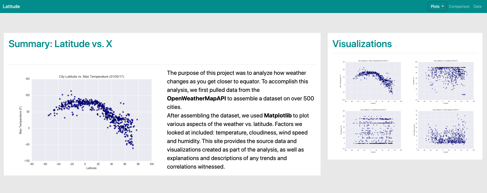

# Weather Web Visualization Dashboard

Data is more powerful when we share it with others!

For this project I'll be creating a visualization dashboard website. Specifically, I'll be plotting weather data for the following list of cities [weather data](WebViz/Resources/cities.csv).

Building this dashboard, I'll create individual pages for each plot and a means by which we can navigate between them. These pages will contain the visualizations and their corresponding explanations. We'll also have a landing page, a page where we can see a comparison of all of the plots, and another page where we can view the data used to build them. 

### Website Structure

Website published on GitHub Pages: [Weather Dashboard]()

The Weather Dashboard contains the following pages:
- Latitude [Index](Index.html)
    - The main project page displaying a summary of the project and vizualization links
- Max Temperature [MaxTemp](WebViz/Max_Temp.html)
    - Page dispaying vizualization for max temperature and link to other related website pages
- Humidity [Humidity](WebViz/Humidity.html)
    - Page dispaying vizualization for humidity and link to other related website pages
- Cloudiness (cloudiness.html)
    - Displays the cloudiness visualization and links to other visualizations.  The current page is shown as active.
- Wind Speed (wind_speed.html)
    - Displays the wind speed visualization and links to other visualizations.  The current page is shown as active.
- Comparison (comparison.html)
        - Displays the all four visualizations. Each visualization is a link to their individual page.
- Data (data.html)
        - Displays the source tabular data for the project.
